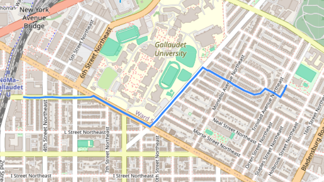
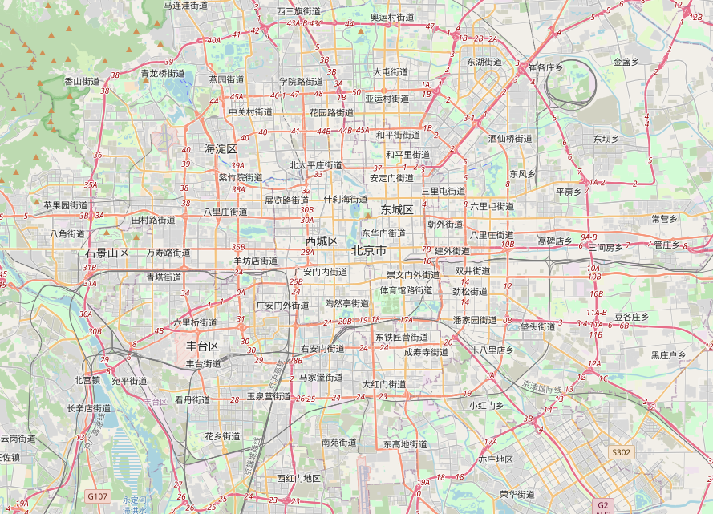
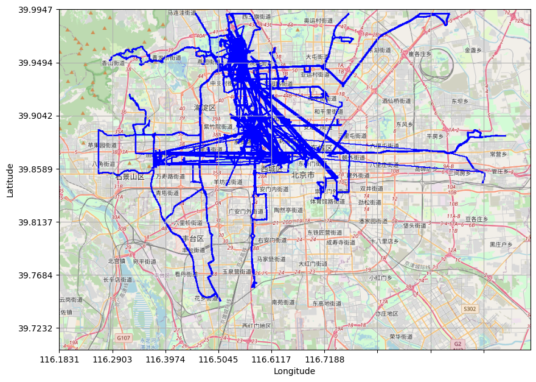

# GPS Data and Bike Trip Analysis

This repository aims to provide tools for **visualizing and analyzing GPS data**, particularly focusing on bike trip data and trajectories. Description of below Python scripts:

## 1. `bike_trip.py`

This script contains a class `BikeTrip` for solving problems related to bike trip data. Here are some of the functionalities provided by this class:

- Processing bike trip data
- Calculating statistics such as maximum trip duration, minimum trip duration, count of minimum trip duration, and percentage of circular trips
- Filtering data based on time range
- Finding feasible trips and unique depots
- Generating graphs and **shortest routes** on maps

### How to use `bike_trip.py`

To use the functionalities provided by `BikeTrip` class, follow these steps:

1. Ensure you have the necessary dependencies installed (`pandas`, `numpy`, `matplotlib`, `geopy`, `networkx`, `osmnx`, `PIL`).
2. Import `BikeTrip` class from `bike_trip.py`.
3. Create an instance of `BikeTrip` by passing the path to your bike trip data CSV file.
4. You can then call various methods of `BikeTrip` class to analyze and visualize the data.

## 2. `gps.py`

This script contains two classes: `GPSVis` for visualizing GPS data on a map and `GPSdata` for analyzing GPS trajectories. Here's what each class does:

### `GPSVis`

- `GPSVis` class provides methods for plotting GPS data on a map image.
- It allows customization of the map output, including saving the map to a file.
- The class takes GPS records and a pre-downloaded **OSM map** image as inputs.

### `GPSdata`

- `GPSdata` class offers functionalities for processing GPS trajectory data.
- It calculates the **distance traveled** by each user in the provided dataset.
- It **filters GPS data points** for a specific geographical area (e.g., Beijing) and exports them to a CSV file.

### How to use `gps.py`

To utilize the functionalities provided by `GPSVis` and `GPSdata` classes:

1. Ensure you have the required dependencies installed (`pandas`, `numpy`, `matplotlib`, `geopy`, `PIL`).
2. Import the necessary classes from `gps.py`.
3. Create instances of these classes, providing the required input parameters.
4. Utilize the methods provided by these classes to visualize and analyze GPS data.

## Usage Examples

- Example usage of both scripts is demonstrated in the `if __name__=="__main__"` blocks within each file.
- You can refer to these examples to understand how to use the functionalities provided by each script.

## Results
- Shortest Path ( origin_node, destination_node, method = `dijakstra`) 

- Beijing [OSM](https://www.openstreetmap.org/#map=4/21.84/82.79) map 

- Bike trip traffic on Beijing map 

## Note

Ensure that you have the required data files (due to large size I am not pushing here) and map images in the specified paths before running the scripts.

Feel free to explore and customize these scripts according to your specific requirements!
